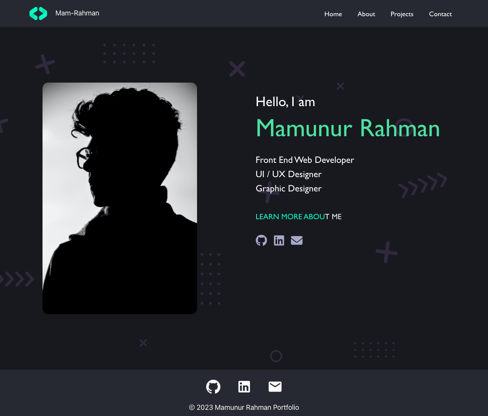

# Mam's React Portfolio

Welcome to my React portfolio site! This project serves as an interactive and dynamic way to showcase my skills, projects, and experience. 

 ## Table Of Contents
  - [Description](#description)
  - [Features](#features)
  - [Links](#links)
  - [Screenshot](#screenshot)
  - [Technologies Used](#technologies-used)
  - [License](#license)

--- 

## Description
"Mam's React Portfolio" is an initial scaffolding of my portfolio website, built from scratch using React. The app aims to show potential employers my skills and projects.

--- 

## Features
- Responsive and visually appealing design.
- Sections for showcasing your personal information, skills, projects, and contact details.
- Integration with React for a smooth user experience.
- Easy-to-customize content and styling.
- Contact form for receiving messages from visitors.

---

## Links
 
- Link to deployed website: https://mams-react-portfolio.vercel.app 

--- 

## Screenshot

---

## Technologies Used
- JavaScript
- React Js
- React Router
- Material Icons - Material UI - MUI
- Bootstrap
- Font Awesome

---

## License

Mam's React Portfolio is licensed under the
MIT License
A short and simple permissive license with conditions only requiring preservation of copyright and license notices. Licensed works, modifications, and larger works may be distributed under different terms and without source code.

